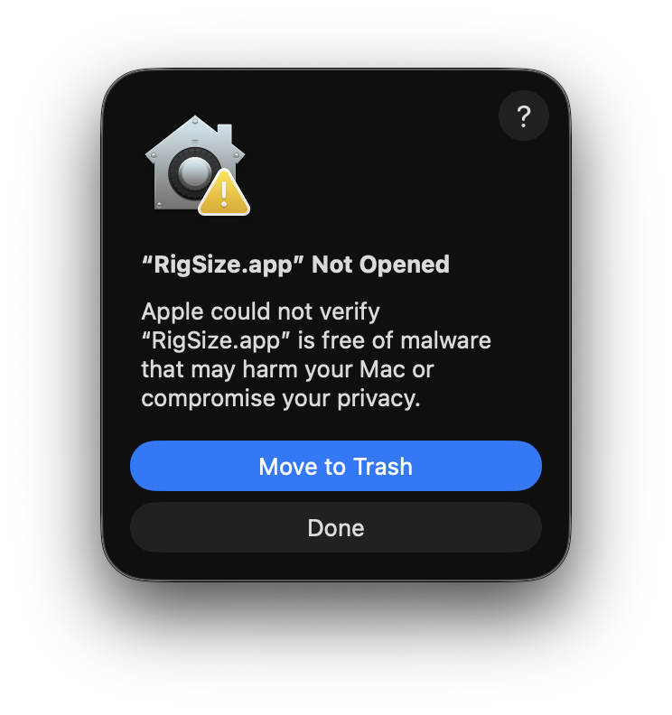
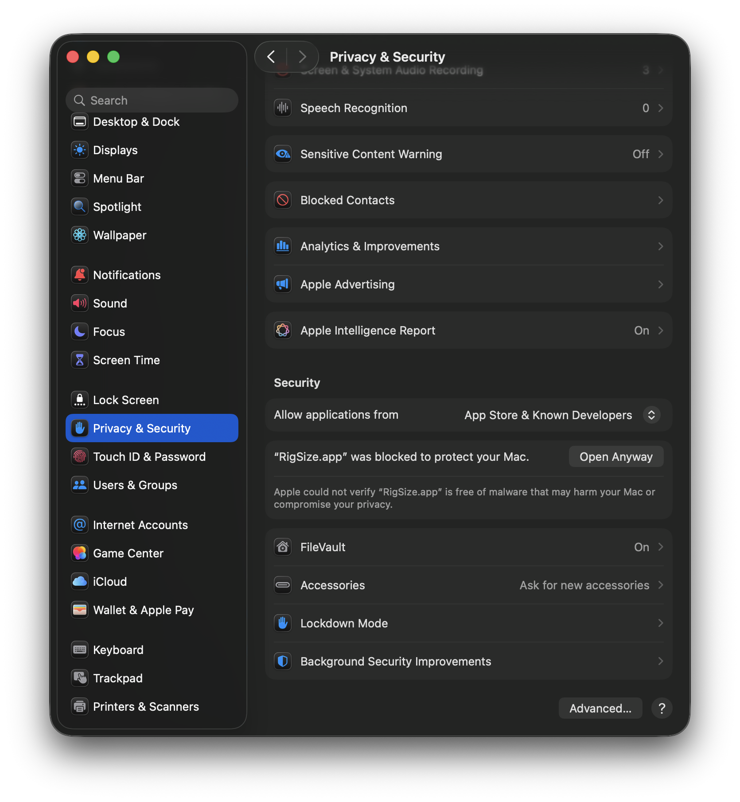
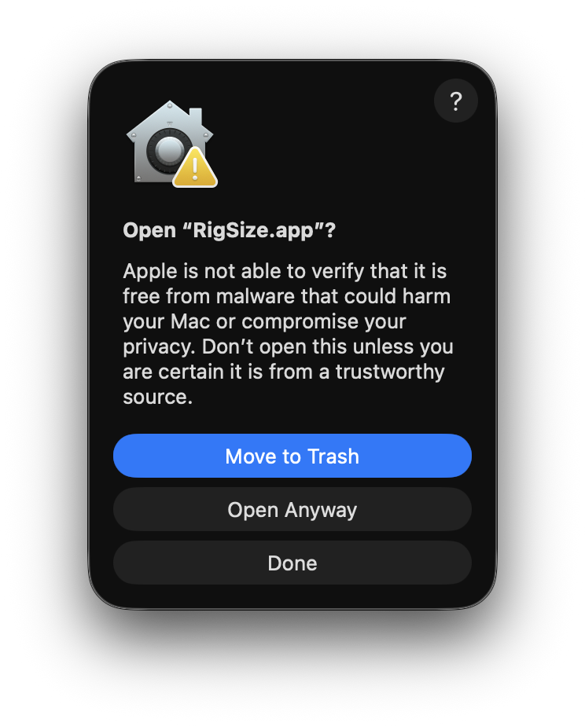
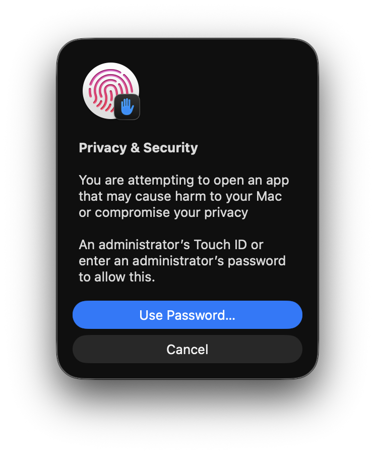
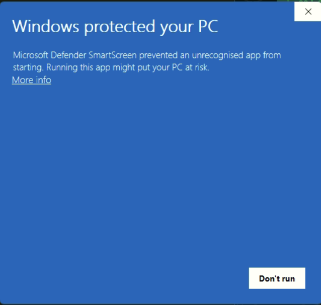
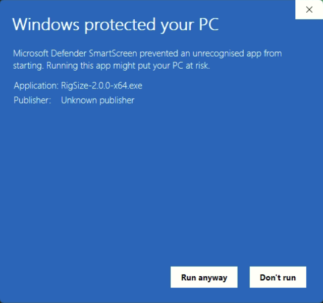
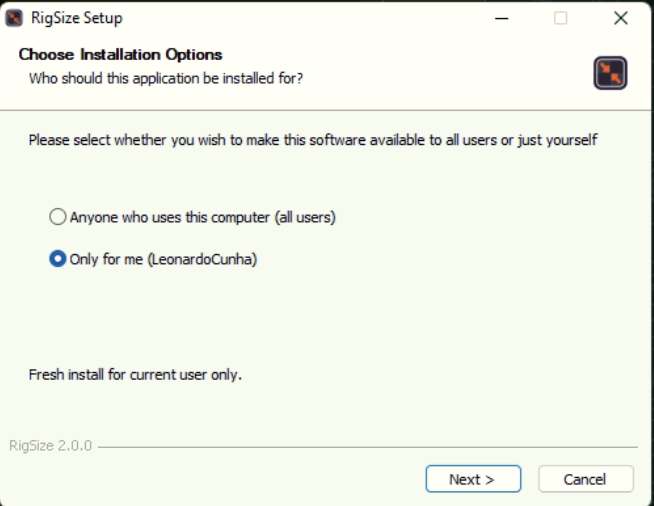
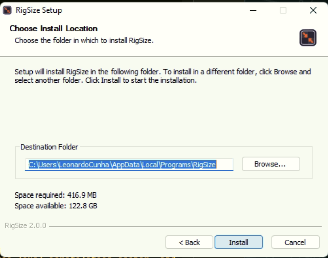
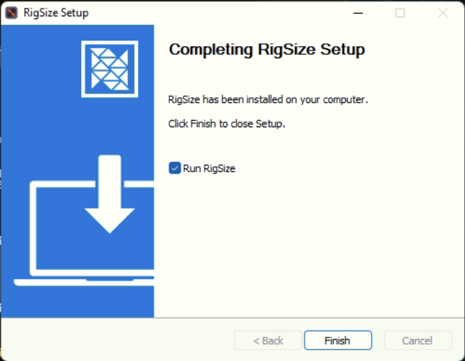

# Installing RigSize

Pre-built installers are published to GitHub Releases for each tagged version. This guide walks through download → install → first-launch on macOS and Windows. No `git`, Node.js, or developer tooling required.

> **Latest release:** [github.com/Dzazaleo/RigSize-releases/releases](https://github.com/Dzazaleo/RigSize-releases/releases)
>
> Pick the asset that matches your OS:
>
> - macOS (Apple Silicon): `RigSize-<version>-arm64.dmg`
> - Windows (64-bit): `RigSize-<version>-x64.exe`

---

## macOS

**Note:** This build is signed ad-hoc, not with an Apple Developer ID. The first launch triggers Gatekeeper, and the flow is longer than you might expect — **four stages**, ending in an administrator authentication. It is one-time per binary: afterwards the app opens normally from Applications, Launchpad, or Spotlight.

> ⚠️ **Two things to know before you start:**
>
> 1. At stages 1 and 3 below, the blue default button is **Move to Trash** — it deletes the app. Pressing Return twice out of habit deletes your download. Read each dialog before confirming.
> 2. Stage 4 asks for **an administrator's** Touch ID or password — not just any account's. If you use a standard (non-administrator) account, you cannot complete the first launch on your own; someone with an administrator account on that Mac must enter their credentials. Windows has no equivalent requirement — see the Windows section.

### Install

1. Download `RigSize-<version>-arm64.dmg` from the Releases page.
2. Double-click the downloaded `.dmg`. macOS mounts the disk image and shows a Finder window with the app icon next to an Applications folder shortcut.
3. Drag **RigSize.app** into **Applications**.

### First launch — the four stages (macOS 15 Sequoia and later)

1. **The block dialog.** Open **Applications** in Finder and double-click **RigSize**. macOS shows a dialog titled _“RigSize.app” Not Opened_:

   _“Apple could not verify ‘RigSize.app’ is free of malware that may harm your Mac or compromise your privacy.”_

   

   The only buttons are **Move to Trash** (blue, default) and **Done**. There is **no Open button**, and nothing in this dialog tells you where to go next — the only way forward is System Settings, and the dialog does not say so. Click **Done**. Do **not** press Return: **Move to Trash** is the default button here, and it deletes the app.

2. **System Settings.** Open **System Settings → Privacy & Security** and scroll down to the **Security** section near the bottom of the pane. This is not a dialog — you have to know to come here. You'll see a row reading:

   _“RigSize.app” was blocked to protect your Mac._

   

   Click **Open Anyway** next to it.

3. **The confirmation dialog.** A dialog titled _Open “RigSize.app”?_ appears. Its buttons, top to bottom, are **Move to Trash** (blue, default) · **Open Anyway** · **Done**. There is **no Open button** — the button that proceeds is **Open Anyway**, the *middle* one. The destructive **Move to Trash** is the default again, so pressing Return here deletes the app.

   

   Click **Open Anyway** (the middle button).

4. **Administrator authentication.** A **Privacy & Security** prompt appears asking for **an administrator's Touch ID or an administrator's password**, with buttons **Use Password…** (blue, default) · **Cancel**. This is the stage that actually launches the app — clicking Open Anyway at stage 3 does not open it by itself. A standard (non-administrator) account cannot complete this step.

   

   Authenticate with an administrator's Touch ID or password. The app launches.

Future launches work normally — double-click from Applications, Spotlight (`Cmd+Space` → type "RigSize"), or Launchpad. The Gatekeeper bypass is one-time per binary.

### Older macOS versions (14 Sonoma and earlier)

The right-click bypass path may still work as a one-step alternative on macOS 14 and earlier:

1. **Right-click** (or Control-click) the app icon in Applications. Choose **Open** from the context menu.
2. macOS shows: _"App cannot be opened because the developer cannot be verified."_ Click **Open Anyway** (or **Open**, depending on the exact macOS version).

If the right-click path doesn't show an "Open Anyway" option, fall back to the System Settings flow above (it works on every macOS version that supports the app). On macOS 15 and later the right-click path no longer offers an Open option at all — use the four-stage flow.

### Troubleshooting

- **"App is damaged and can't be opened"**: the macOS quarantine attribute is sometimes set on downloaded files in unexpected ways. In Terminal, clear quarantine and re-attempt the first launch:

  ```bash
  xattr -cr "/Applications/RigSize.app"
  ```

---

## Windows

**Note:** This build is unsigned (no code-signing certificate). The first run triggers Microsoft Defender SmartScreen — two dialog stages — followed by three installer pages. The install is per-user: **no administrator rights are required and no User Account Control prompt appears at any point**. This is the opposite of macOS, where stage 4 demands an administrator's credentials. (That statement covers installation; first launch is a separate step.)

### Install and first run — the five stages

1. **SmartScreen blocks the download.** Download `RigSize-<version>-x64.exe` from the Releases page and double-click it. Windows shows a dialog titled **Windows protected your PC**:

   _"Microsoft Defender SmartScreen prevented an unrecognised app from starting. Running this app might put your PC at risk."_

   

   The app is **not named** at this stage — the dialog says only that "an unrecognised app" was blocked, with no indication of which one. The sole button is **Don't run**; the way forward is the small **More info** link.

   _Spelling note:_ the screenshot was taken on a UK-English system, which renders _unrecognised_; a US-English system renders _unrecognized_. Same dialog either way.

2. **The identity panel.** Click **More info**. The link is replaced in place by two identity lines — `Application: RigSize-<version>-x64.exe` and `Publisher: Unknown publisher` — plus a **Run anyway** button next to **Don't run**.

   

   **Publisher: Unknown publisher** is what you should expect to see: the product is not code-signed, so Windows has no publisher name to show. Confirm the `Application:` line names the file you downloaded, then click **Run anyway**.

3. **Installation options.** The **RigSize Setup** installer opens on **Choose Installation Options**. _Only for me_ is selected by default, and the status line reads _Fresh install for current user only._ Keep the default and click **Next >**.

   

4. **Install location.** The **Choose Install Location** page proposes `C:\Users\<you>\AppData\Local\Programs\RigSize`. That is a new folder of its own — next to, not replacing, any older `Spine Texture Manager` folder you may have. Keep the default and click **Install**.

   

5. **Completion.** The **Completing RigSize Setup** page reads _RigSize has been installed on your computer._ The **Run RigSize** checkbox is checked by default. Click **Finish**.

   

Afterwards, launch from the Start Menu (search "RigSize") or the Desktop shortcut if the installer offered one.

### Troubleshooting

- **The `.exe` doesn't open after Run anyway**: confirm the file is fully downloaded (size matches the GitHub Releases asset listing). If the file is truncated, redownload.
- **Antivirus quarantines the installer**: Windows Defender occasionally flags unsigned NSIS installers. Whitelist the `.exe` in your AV's quarantine list, or contact your IT department if you are on a managed machine.

---

## Coming from Spine Texture Manager 1.x

RigSize 2.0.0 installs **alongside** Spine Texture Manager 1.9.4 — on Windows into its own `RigSize` folder next to the old app's folder, and on macOS as `RigSize.app` next to `Spine Texture Manager.app` in Applications. The old version keeps working and keeps its own settings. Preferences and the Open Recent list do **not** carry over to 2.0.0 — it starts with a clean slate.

---

## After installation: auto-update

Once installed, the app checks GitHub Releases for newer versions on startup (silently — only shows a prompt if an update is available). You can also check manually via **Help → Check for Updates**.

On macOS and Windows, the app shows a non-blocking notice with a button to open the Releases page — download the new installer manually and run it (re-triggering the first-launch Gatekeeper / SmartScreen step).

---

## Reporting issues

Found a bug? Open an issue at [github.com/Dzazaleo/RigSize-releases/issues](https://github.com/Dzazaleo/RigSize-releases/issues). Include:

- Your OS + version (e.g. macOS 14.4, Windows 11 23H2, Ubuntu 24.04).
- The app version (the file name of the installer you ran, or check **Help → About** if available).
- Steps to reproduce + the output you expected vs got.
